# 第一章 递归问题

## 1.1 河内塔

1883年  爱德华·卢卡斯[法]

给定一个由8个圆盘组成的塔，这些圆盘按照大小递减的方式套在三根桩柱中的一根上。我们的目的是要将整个塔移动到另一根桩柱上，**每次只能移动一个圆盘，且较大的圆盘在移动过程中不能放置在较小的圆盘上面**。

解：令$T_n$是根据卢卡斯规则将n个圆盘从一根桩柱移动到另一根桩柱所需要的最少移动次数。
		那么显然有$T_0=0、T_1=1、T_2=3$

​		移动3个圆盘的思路：先把上面两个圆盘移动到中间的桩柱上，然后移动第三个圆盘，接着再把其余两个放到		它上面。
​		这个方法可以推广到n个圆盘：首先把上面的$n-1$个小圆盘移动到一个不同的桩柱上(需要$T_{n-1}$次移动)，然		后移动最大的圆盘(需要一次移动)，最后再把那$n-1$个小圆盘移回到最大圆盘上面(这需要另外的$T_{n-1}$次移		动)。这样，至多需要$2T_{n-1}+1$次移动就能移动$n(n>0)$个圆盘了：
$$
T_n\leq2T_{n-1}+1，n>0
$$
​		又因为我们迟早必须移动最大的那个圆盘。当我们这样做时，那$n-1$个小圆盘就必须已经在某根桩柱上，而		这至少需要$T(n-1)$次移动才能把它们放置到那儿。移动最大的圆盘只需一次，但之后需要把那$n-1$个小圆		盘(它们必须仍然在同一根桩柱上)移回到最大圆盘上面，这也需要$T_{n-1}$次移动。从而：
$$
T_n\geq2T_{n-1}+1，n>0
$$
​		把这两个不等式与$n=0$时的平凡解结合在一起就得到**递归式**：
$$
\begin{align}
T_0=&0;\\
T_n=&2T_{n-1}+1,n>0.
\end{align}
$$
1. 求得**封闭形式**的解的一种方法时猜出正确的解，然后证明我们的猜想时正确的。

$$
\begin{align}
T_0=&0\\
T_1=&1\\
T_2=&3\\
T_3=&2\times3+1=7\\
T_4=&2\times7+1=15\\
T_5=&2\times15+1=31\\
T_6=&2\times31+1=63
\end{align}
$$
​		这看起来肯定像是$T_n=2^n-1，n\geq0$，至少这对$n\leq6$是成立的。

​		接下来使用**数学归纳法**：
$$
其基础是显然的，因为T_0=2^0-1=0.\\而如果我们假设当n被n-1取代时T_n=2^n-1，n\geq0成立\\
则对n>0用归纳法就得出：\\T_n=2T_{n-1}+1=2(2^{n-1}-1)+1=2^n-1\\
从而式子对n也成立。
$$

  2. 求**封闭形式**的解的另一种方法：
     把递归式中方程的两边加上1可得到：
     $$
     \begin{align}
     T_0+1=&1;\\
     T_n+1=&2T_{n-1}+2,n>0.
     \end{align}
     $$
     现在令$U_n=T_n+1$，那么就有：
     $$
     \begin{align}
     U_0=&1;\\
     U_n=&2U_{n-1},n>0.
     \end{align}
     $$
     现在很明显就可以看出解正是$U_n=2^n$，从而有$T_n=2^n-1$。

## 1.2 平面上的直线

用一把比萨刀直直地切n刀，可以得到多少块比萨饼？或者说得更有学术味儿点：平面上n条直线说界定的区域的最大个数$L_n$是多少？这个问题于1826年被一位瑞士数学家$斯坦纳^{338}$首先解决。

解：记住，首先研究所有情形中之最小者。
		没有直线的平面有1个区域；有一条直线的平面有2个区域；有两条直线的区域有4个区域。
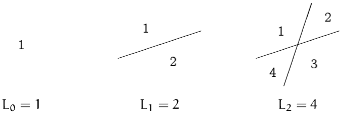

首先一定会想到$L_n=2^n$，当然！增加一条新的直线直接使区域的个数加倍，遗憾的是，这是错误的。

因为，如果第n条直线能把每个已有区域分为两个，那么就能加倍。它肯定能把一个已有区域至多分成两个，这是因为每个已有区域都是凸的(**一条直线可以把一个凸区域分成至多两个新区域，这些新的区域也将是凸的**)。但是当增加第三条直线时，我们很快发现，不论怎样放置前面两条直线，它只能至多分裂3个已有的区域：
      										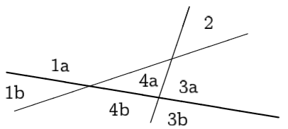
从而$L_3=4+3=7$是我们能做到的最好结果。

略加思考之后，我们可以给出适当的推广：第$n(n>0)$条直线使得区域的个数增加k个，当且仅当它对k个已有区域进行了分裂；而它对k个已有区域进行分裂，当且仅当它在$k-1$个不同的地方与前面那些直线相交。两条直线至多相较于一点，因而这条新的直线与那$n-1$条已有直线至多相交于$n-1$个不同的点，故必定有$k\leq n$。我们就证明了上界：
$$
L_n\leq L_{n-1}+n,n>0.
$$
此外，用归纳法容易证明这个公式中的等号可以达到。我们径直这样来放置第n条直线，使得它不与其他直线中的任何一条平行(从而它与它们全部相交)，且它不经过任何已经存在的交点(从而它与它们全都在不同的点相交)。于是该递归式即为：
$$
\begin{align}
L_0=&1;\\
L_n=&L_{n-1}+n,n>0.
\end{align}
$$
现在求封闭式的解：因$1、2、4、7、11、17····$看起来并不熟悉，故而另辟蹊径。
我们常常可以通过将它从头到尾一直“展开”或者“解开”来弄清楚递归式，如下：
$$
\begin{align}
L_n=&L_{n-1}+n\\
=&L_{n-2}+(n-1)+n\\
=&L_{n-3}+(n-2)+(n-1)+n\\
\vdots\\
=&L_0+1+2+\cdots+(n-2)+(n-1)+n\\
=&1+S_n,其中S_n=1+2+3+\cdots+(n-1)+n.
\end{align}
$$
换句话说，$L_n$比前n个正整数的和$S_n$大1。

**三角形数**：

|    n    |  1   |  2   |  3   |  4   |  5   |  6   |  7   |  8   |  9   |  10  |  11  |  12  |  13  |  14  |
| :-----: | :--: | :--: | :--: | :--: | :--: | :--: | :--: | :--: | :--: | :--: | :--: | :--: | :--: | :--: |
| $S_{n}$ |  1   |  3   |  6   |  10  |  15  |  21  |  28  |  36  |  45  |  55  |  66  |  78  |  91  | 105  |

为计算$S_n$，我们利用据说高斯在1786年想的一个技巧，那时他只有9岁
(阿基米德也曾在他关于螺旋线的经典著作的命题10和命题11中用到过)：
$$
\begin{align}
S_n=&1&+&2&+&3&+&\cdots&+&(n-1)&+&n\\
+S_n=&n&+&(n-1)&+&(n-2)&+&\cdots&+&2&+&1\\
\Rightarrow2S_n=&(n+1)&+&(n+1)&+&(n+1)&+&\cdots&+&(n+1)&+&(n+1)
\end{align}
$$
简化即得：
$$
S_n=\frac{n(n+1)}2,n\geq0,
$$
好的，我们就有解答：
$$
L_n=\frac{n(n+1)}2+1,n\geq0.
$$
我们再使用归纳法做一个严格的证明：
$$
\begin{align}
&当n=0，1，2时，L_n显然成立；\\
&令n=k时，L_n也成立；\\
&则n=k+1时有：\\
&L_{k+1}=L_k+k+1=\frac{k(k+1)}2+1+k+1=\frac{(k+1)(k+2)}2+1.
\end{align}
$$

**延伸：**
现在我们谈谈平面上直线问题的一个变形：假设我们用折线代替直线，每一条折线包含一个“锯齿”。平面上由n条这样折线所界定的区域的最大个数$Z_n$是多少？
解：同样从这些小的情形出发：
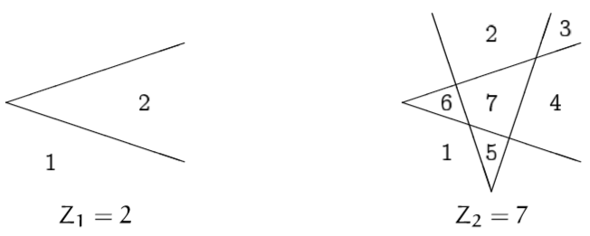
我们意识到：除了这“两条”直线不经过它们的交点延伸出去使得区域相融合之外，一条折线与两条直线类似：

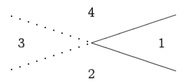

当我们放置得当——锯齿点必须放在它与其它直线的交点“之外”，也就是说，对每条折线我们仅仅失去两个区域：
$$
Z_n=L_{2n}-2n=\frac{2n(2n+1)}2+1-2n\\
=2n^2-n+1,n\geq0.
$$
比较两者，我们发现对于大的n有：
$$
L_n\sim\frac12n^2,\\
Z_n\sim2n^2;
$$
所以用折线所能得到的区域是用直线所能得到的区域的大约4倍。

## 1.3 约瑟夫问题

以夫拉维·约瑟夫(一世纪著名历史学家)
在犹太罗马战争期间，它们41名犹太反抗者困在了罗马人包围的洞穴中。这些反抗者宁愿自杀也不愿被活捉，于是决定围成一个圆圈，并沿着圆圈每隔两个人杀死一个人，知道剩下最后两个人为止。但是，约瑟夫和一个未被告发的同谋者不希望无谓地自杀，于是他迅速计算出他和其朋友在这个险恶的圆圈中应该站的位置。

我们这个问题略有变化，从围成标有记号1到n的圆圈的n个人开始，每隔一个删去一个人，直到只有一个人幸存下来。例如n=10的起始图形：

​                                                                  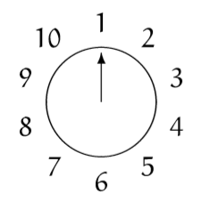

消去的顺序是：2，4，6，8，10，3，7，1，9，于是5幸存下来。问题：确定幸存者的号码$J(n)$。

解：同样先研究小的情形：

|    n    |  1   |  2   |  3   |  4   |  5   |  6   |
| :-----: | :--: | :--: | :--: | :--: | :--: | :--: |
| $J(n) $ |  1   |  1   |  3   |  1   |  3   |  5   |

似乎$J(n)$总是奇数。事实上，对此有一个好的解释：绕这个圈走第一圈就消除了所有的偶数号码。

对于n是偶数的情形：
不妨假设一开始有$2n$个人。经过第一轮后剩下的是：
																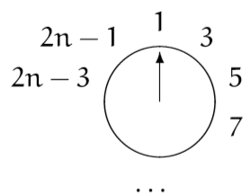

3号是下一个要离开的人。除了每个人的号码加倍并减去1之外，这正像对n个人开始时的情形。就是说：
$$
J(2n)=2J(n)-1，n\geq1.
$$
对于n是奇数的情形：
不妨假设一开始有$2n+1$个人，显然标号为1的人恰好是在标号为$2n$的人后面被删除，剩下的是：
													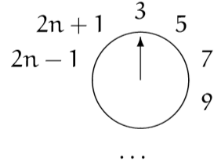
我们再次得到与有n个人开始时几乎相同的情形，但是这一次他们的号码加倍并增加了1。从而：
$$
J(2n+1)=2J(n)+1，n\geq1.
$$
组合起来，我们就可以得到所有情形下$J$的递归式：
$$
\begin{align}
J(1)=&1;\\
J(2n)=&2J(n)-1,n\geq1;\\							
J(2n+1)=&2J(n)+1,n\geq1.
\end{align}
$$
这次不是由$J(n-1)$得到$J(n)$，但这个递归式要“有效”得多，因为每次用到它的时候，都会用2来缩减n。但我们仍然要寻找一个封闭形式，因为封闭形式计算起来更快，也蕴涵更丰富的信息。

有了递归式，我们可以对很小的值快速做出一张表：

|   n    |  1   | 2    |  3   |  4   |  5   |  6   |  7   |  8   |  9   |  10  |  11  |  12  |  13  |  14  | 15   |  16  |
| :----: | :--: | ---- | :--: | :--: | :--: | :--: | :--: | :--: | :--: | :--: | :--: | :--: | :--: | :--: | ---- | :--: |
| $J(n)$ |  1   | 1    |  3   |  1   |  3   |  5   |  7   |  1   |  3   |  5   |  7   |  9   |  11  |  13  | 15   |  1   |

看来似乎可以按照2的幂将表中的数据分组，每一组的开始$J(n)$总是等于1，并且组里的数组每次递增2.因此我们将n写成$n=2^m+l$的形式，其中$2^m$是不超过n的2的最大幂，而$l$则是剩下的数，那么递增式的解看起来是：
$$
J(2^m+l)=2l+1,m\geq0,0\leq l<2^m.\\
注意：如果2^m\leq n<2^{m+1}，则余下来的数l=n-2^m满足0\leq l<2^{m+1}-2^m=2^m.
$$
现在给出式(1.9)的**证明**：
当$m=0$时必定有$l=0$，于是式(1.9)的基础就是$J(1)=1$，此结论为真。
归纳证明分成两个部分，按照$l$是偶数还是奇数而定。

1. 如果$m>0且2^m+l=2n$，那么$l$是偶数，又根据式(1.8)和归纳假设，有：
   $$
   J(2^m+l)=2J(2^{m-1}+l/2)-1=2(2l/2+1)-1=2l+1,
   $$

2. 如果$m>0且2^m+l=2n+1$，那么$l$是奇数，又根据式(1.8)和归纳假设，有：
   $$
   J(2^m+l)=2J(2^{m-1}+(l-1)/2)+1=2(2(l-1)/2+1)+1=2l+1
   $$

完成了归纳法，也就证明了式(1.9)。同时式(1.8)还蕴涵着关系式$J(2n+1)-J(2n)=2$。

**扩展及推广：**
我们在求解的过程中，2的幂起着重要的作用，所以自然要来研究$n$和$J(n)$的以2为基数的表示。假设$n$的二进制展开式是：
$$
n=(b_mb_{m-1}\cdots b_1b_0)_2,
$$
也就是说，
$$
n=b_m2^m+b_{m-1}2^{m-1}+\cdots+b_12+b_0,
$$
其中每个$b_i$为0或1，而首位数字$b_m$必须是1.注意$n=2^m+l$，我们依次就有
$$
\begin{align}
n=&(1b_{m-1}b_{m-2}\cdots b_1b_0)_2,\\
l=&(0b_{m-1}b_{m-2}\cdots b_1b_0)_2,\\
2l=&(b_{m-1}b_{m-2}\cdots b_1b_00)_2,\\
2l+1=&(b_{m-1}b_{m-2}\cdots b_1b_01)_2,\\
J(n)=&(b_{m-1}b_{m-2}\cdots b_1b_0b_m)_2.
\end{align}
$$
我们就证明了
$$
J((b_mb_{m-1}\cdots b_1b_0)_2)=(b_{m-1}\cdots b_1b_0b_m)_2.
$$
用计算机程序设计的方法说就是，**$n$向左循环移动一位就得到$J(n)$！**

如果我们从$n$开始，并对函数$J$迭代$m+1$次，那么就做了$m+1$次移位。由于$n$是一个$m+1$位的数，因此我们或许会期待再次得到$n$来结束循环。但是事实并不一定如此。例如：
				如果$n=13$，我们就有$J((1101)_2)=(1011)_2$，而此后却有$J((1011)_2)=(111)_2$。
故而该过程中断。当0成为首位时，它就会消失掉。

实际上，根据定义$J(n)$必定总是$\leq n$，这是因为$J(n)$是幸存者的号码；于是，如果$J(n)<n$，那么继续迭代下去永远也不可能回到$n$。重复运用$J$就会得到一列递减的值，它们最终到达一个“不动点”，在该点有$J(n)=n$。利用循环移位性质容易看出，不动点将是：对函数迭代足够多的次数总是会产生出全由1组成的形式，它的值是$2^{v(n)}-1$，其中$v(n)$是$n$的二进制表示中1的个数。于是，由于$v(13)=3$，我们有：
$$
\overbrace{J(J(···J}^{2个或者更多个J}(13)\cdots ))=2^3-1=7.
$$
类似地有
$$
\overbrace{J(J(\cdots J}^{8个或者更多个J}((101101101101011)_2)\cdots))=2^{10}-1=1023.
$$
结果令人惊奇，但正确无误。

让我们暂时回到第一个猜测：但$n$为偶数时有$J(n)=\frac n2$。它在一般情形下显然并不成立，不过现在我们可以确定它在什么情形下成立：
$$
\begin{align}
J(n)=&\frac n2,\\
2l+1=&(2^m+l)/2,\\
l=&\frac13(2^m-2).
\end{align}
$$

如果这个数$l=\frac13(2^m-2)$是整数，那么$n=2^m+l$就是一个解，这是因为$l$小于$2^m$。不难验证，当$m$为奇数时，$2^m-2$是3的倍数，但当$m$为偶数时则不然。于是方程$J(n)=\frac n 2$有无穷多个解，前面的解如下：
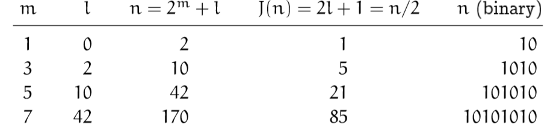
注意最右列的形状。这些是二进制数，对它们向左循环移动一位与通常的向右移动一位(减半)，会产生同样的结果

我们现在非常了解函数$J$了，下一步对它加以推广。
如果我们的问题产生了与$(39)-(41)$有些相像的的递归式(不过有不同的常数)，将会发生什么？。引入常数$\alpha、\beta和\gamma$，并力图对更加一般的递归式求出一个封闭形式，以此来研究这个问题。
$$
\begin{align}
f(1)=&\alpha;\\
f(2n)=&2f(n)+\beta,n\geq1;\\
f(2n+1)=&2f(n)+\gamma,n\geq1.\\
\end{align}
$$
(原来的递归式中有$\alpha=1、\beta=-1以及\gamma=1.$)
从$f(1)=\alpha$出发并按照我们的思路做下去，可以对小的n值构造出如下一般性的表：
                                                    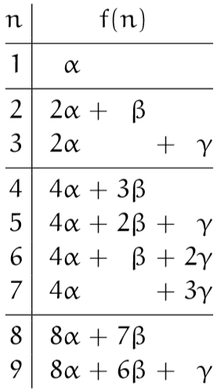

从表中可以看出：

1. $\alpha$的系数是不超过$n$的2的最大幂；
2. 在2的幂之间，$\beta$的系数递减1直到得到0；
3. $\gamma$的系数则从0开始递增1.

于是，如果把$f(n)$对$\alpha、\beta和\gamma$的依存关系分离开来，我们就把它表示成形式：
$$
f(n)=A(n)\alpha+B(n)\beta+C(n)\gamma，
$$
看起来有：
$$
\begin{align}
A(n)=&2^m;\\
B(n)=&2^m-1-l;\\
C(n)=&l.
\end{align}
$$
如通常一样，这里有$n=2^m+l$以及$0\leq l<2^m\quad(n\geq1).$

用先前的归纳法可轻松证明$(61)-(64)$。但我们有一个更好的办法，通过选取特殊的值，然后将它们组合起来。
我们考虑$\alpha=1，\beta=\gamma=0$这一特殊情形来对此方法加以说明。即此时假设$f(n)$等于$A(n)$，则有：
$$
\begin{align}
A(1)=&1;\\
A(2n)=&2A(n),\quad n\geq1;\\
A(2n+1)=&2A(n),\quad n\geq1.
\end{align}
$$
足以肯定的是，$A(2^m+l)=2^m$为真(对m用归纳法)。

接下来，我们反过来使用递归式$(58)-(60)$以及解$(61)$，从一个简单的函数$f(n)$出发，并研究是否有任何常数$(\alpha,\beta,\gamma)$能定义它。比方说：

1. 把常数函数$f(n)=1$代入$(58)-(60)$得到：
   $$
   \begin{align}
   1=&\alpha;\\
   1=&2\times1+\beta;\\
   1=&2\times1+\gamma.
   \end{align}
   $$
   从而满足这些方程的值$(\alpha,\beta,\gamma)=(1,-1,-1)$将给出$A(n)-B(n)-C(n)=f(n)=1$.

2. 类似地，我们可以代入$f(n)=n$：
   $$
   \begin{align}
   1=&\alpha;\\
   2n=&2\times n+\beta;\\
   2n+1=&2\times n+\gamma.
   \end{align}
   $$
   当$\alpha=1，\beta=0$及$\gamma=1$时，这些方程对所有的$n$都成立，所以不需要用归纳法来证明这些参数会给出$f(n)=n$。我们已经知道，$f(n)=n$是这种情形的解，因为递归式$(58)-(60)$对每个$n$的值都唯一地定义$f(n)$。

现在我们完成证明了！我们证明了，在一般情形解递归式$(58)-(60)$时，所得到的解$(61)$中的函数$A(n)、B(n)$和$C(n)$满足方程
$$
\begin{align}
A(n)=&2^m,其中n=2^m+l且0\leq l<2^m;\\
A(n)-B(n)-C(n)=&1;\\
A(n)+C(n)=&n.
\end{align}
$$
解之可得$(62)-(64)$.

这一做法描绘出对求解递归式有惊人效果的**成套方法**。首先我们来寻求一组已知其解的通用参数，这会给我们一整套可以求解的特殊情形。然后将特殊情形组合起来得到一般的情形。有多少个独立的参数(在本例中有三个，即($\alpha、\beta$和$\gamma$)就需要有多少个独立的特解。

我们知道，原来的约瑟夫递归式有个奇妙的解，写成二进制就是：
$$
J((b_mb_{m-1}\cdots b_1b_0)_2)=(b_{m-1}\cdots b_1b_0b_m)_2,\quad其中b_m=1.
$$
那推广的约瑟夫递归式是否有这样奇妙的解呢？
的却如此，为什么不呢？如果令$\beta_0=\beta$以及$\beta_1=\gamma$，那么推广的递归式$(58)-(60)$可改写为：
$$
\begin{align}
f(1)=&\alpha;\\
f(2n+j)=&2f(n)+\beta_j,\quad j=0,1，\quad n\geq1.
\end{align}
$$
这个递归式按照二进制展开就是：
$$
\begin{align}
f((b_mb_{m-1}\cdots b_1b_0)_2)=&2f((b_mb{m-1}\cdots b_1)_2)+\beta_{b_0}\\
=&4f((b_mb_{m-1}\cdots b_2)_2)+2\beta_{b_1}+\beta_{b_0}\\
&\vdots\\
=&2^mf((b_m)_2)+2^{m-1}\beta_{b_{m-1}}+\cdots +2\beta_{b_1}+\beta_{b_0}\\
=&2^m\alpha+2^{m-1}\beta_{b_{m-1}}+\cdots +2\beta_{b_1}+\beta_{b_0}.
\end{align}
$$
假设我们现在解除二进制限制，允许任意的数字，而不仅是数字0和1，那么上述推导告诉我们：
$$
f((b_mb_{m-1}\cdots b_1b_0)_2)=(\alpha\beta_{b_{m-1}}\beta_{b_{m-2}}\cdots\beta_{b_1}\beta_{b_0})_2.
$$
很好。如果把表用另一种方式写成：
                                               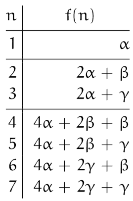
我们就能更早些看到这种规律。
例如：当$n=100=(1100100)_2$时，与前相同，原来的约瑟夫值$\alpha=1、\beta=-1$和$\gamma=1$给出：
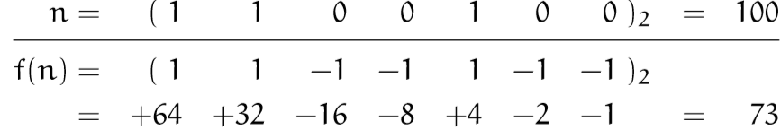
由于在n的二进制表示中每一块二进制数字$(10\cdots00)_2$都被变换成
$$
(1-1\cdots-1-1)_2=(00\cdots01)_2，
$$
因而这就推出循环移位性质。

所以，改变表示法使得我们对于一般的递归式$(78)-(79)$给出了紧凑的解$(85)$。如果真的不受限制，我们现在就可以进一步加以推广。递归式
$$
\begin{align}
f(j)=&\alpha_j,&1\leq j<d;&\\
f(dn+j)=&cf(n)+\beta_j,&0\leq j<d,&\quad n\geq1
\end{align}
$$
与上一个递归式是相同的，除了这里是从基数为$d$的数着手，而产生的值是用基数$c$表示之外。这就是说，它有变动基数的解：
$$
f((b_mb_{m-1}\cdots b_1b_0)_d)=(\alpha_{b_m}\beta_{b_{m-1}}\beta_{b_{m-2}}\cdots \beta_{b_1}\beta_{b_0})_c.
$$
例如：假设凑巧，给定递归式
$$
\begin{align}
f(1)=&34;\\
f(2)=&5;\\
f(3n)=&10f(n)+76,\quad n\geq1;\\
f(3n+1)=&10f(n)-2,\quad n\geq1;\\
f(3n+2)=&10f(n)+8,\quad n\geq1;
\end{align}
$$
并假设我们要计算$f(19)$。这里，有$d=3$以及$c=10$。现在有$19=(201)_3$，而变动基数的解告诉我们，需要做从基数3到基数10的逐位数值替换。故而首位数字2变为5，而0和1分别变成76和-2，这就给出：
$$
f(19)=f((201)_3)=(5 76 -2)_10=1258,
$$
这就是我们的答案。
于是约瑟夫以及犹太罗马战争把我们引向了某种有趣的一般递归式。

## 习题

### 热身题

1. 所有的马都有同样的颜色，我们可以对给定集合中的马匹数量运用归纳法来证明之。理由就是：“如果恰有一匹马，那么它与它自身有相同的颜色，故而基础是显然的。根据归纳法的步骤，假设有n匹马，标号从1到n。根据归纳假设，标号从1到n-1的马都有相同的颜色，类似地，标号从2直到n的马也有相同的颜色，因为这些是马，而不是变色龙。故而根据传递性可知，标号从1直到n的马也必有同样的颜色，于是全部n匹马都有相同的颜色。证毕。”如果这一推理有误，那么错在哪儿？
   **解：**除了n=2的情形，证明是妥当的。如果由两匹马组成的所有集合中马都具有相同的颜色，那么这个命题就对任意个数的马匹的情形为真。

2. 把有n个圆盘的塔从左边的桩柱A移动到右边的桩柱B，不允许在A和B之间直接移动，求最短的移动序列。(每一次移动都必须是移动到中间的桩柱或者从中间的桩柱移出。像通常一样，较大的圆盘永远不能放在较小圆盘的上面。)
   **解：**假设$X_m$表示移动次数。显然有$X_0=0、X_1=2$。
   现在考虑$X_2$的情形：首先必定需要把上面一个圆盘经过C桩柱移动到B桩柱上，即$X_1$。再把下面一个圆盘移动到C桩柱，再重新把上面那个圆盘经C桩柱移动到A桩柱上，即$X_1$。再把下面那个圆盘移动到B桩柱，最后再把上面那个圆盘经C桩柱移动到B桩柱上即可，即$X_1$。故$X_2=3X_1+2$。
   推广到n的情形下就是：
   $$
   \begin{align}
   X_n=&3X_{n-1}+2\\
   =&3^2X_{n-2}+3\cdot2+2\\
   =&3^3X_{n-3}+3^2\cdot2+3\cdot2+2\\
   \vdots\\
   =&3^{n-1}X_1+3^{n-2}\cdot2+\cdots+3\cdot2+2\\
   =&2\cdot(3^{n-1}+3^{n-2}+\cdots+3\cdot2+2)\\
   =&3^n-1
   \end{align}
   $$
   利用归纳法可轻松证明。
   $$
   T(n)=3X_{n-1}+2=3\cdot(3^{n-1}-1)+2=3^n-1
   $$
   **注：经过$\frac12X_n$次移动后，结果整个塔将在中间塔上。**

3. 证明，在上一题限制下的移动过程中，实际上，我们会在3根桩柱上都遇到n个圆盘的每一种正确的叠放。
   **解：**格雷码(Gray Code)：在一组数的编码中，若任意两个相邻的代码只有一位二进制数不同，则称这种编码为格雷码。
   有$3^n$种可能的排列，因为每个圆盘能在任何一个杆上；我们一定会碰上它们的全部，因为最短的解用了$3^n-1$次移动。(这个构造等价于一个“三元Gray码”，它从$(0\cdots0)_3$到$(2\cdots2)_3$贯穿所有数，一次仅改变一个数字位。)

4. 是否存在n个圆盘在3根桩柱上的某种开始叠放或结束叠放，使得按照卢卡斯原来的规则，需要多于$2^n-1$次的移动？
   **解：**不存在。如果最大的圆盘不需要移动，(有归纳法证明)$2^{n-1}$次移动就够了；
   反之$(2^{n-1}-1)+1+(2^{n-1}-1)$次移动就够了(再次根据归纳法)。

5. 由3个重叠的圆做成的维恩图常用来描述与3个给定集合有关的8个可能的子集：
   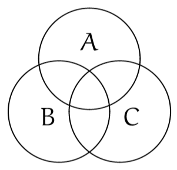
   由4个给定集合给出的16种可能的子集能否用4个重叠的圆来描述？
   **解：**不能。不同的圆至多交于两点，所以第4个圆能组成的区域至多14个。
   我们考虑增加的交点与增加的区域的关系。显然增加的交点数等于增加的区域数。两个不同的圆至多交于两点，而第n个圆至多与n-1个圆相交，即新增的交点数至多有$2(n-1)$个。所以新增的区域数至多有$2(n-1)$个。故有：
   $$
   \begin{align}
   T(1)=&2;\\
   T(n)=&T(n-1)+2(n-1)
   \end{align}
   $$
   $T(4)=T(3)+2(4-1)=T(2)+2(3-1)+2(4-1)=T(1)+2(2-1)+2(3-1)+2(4-1)=14$

   然而用卵形做这次工作是可能的：
   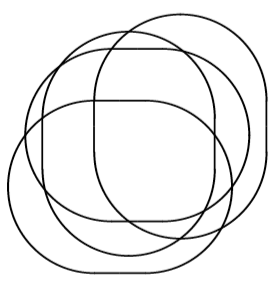
   Vcnn断言用椭圆没有办法来做5个集合的情形，但是Grunbaum发现了用椭圆的一种5个集合的构造。

6. 平面上由n条直线定义的某些区间是无界的，而另一些区域则是有界的。有界区域的最大个数是多少？
   **解：**如果第n条直线和前面的直线相交于$k>0$的不同的点，我们得到$k-1$个新的有界域(假设前面的直线相互不平行)和2个新的无界域。因此有界域的最大个数是$(n-2)+(n-3)+\cdots+1=S_{n-2}=\frac{(n-1)(n-2)}{2}=L_n-2n$。

7. 设$H(n)=J(n+1)-J(n)$。方程$(39)-(41)$告诉我们有$H(2n)=2$，而对$n\geq1$有$H(2n+1)=J(2n+2)-J(2n+1)=(2J(n+1)-1)-(2J(n)+1)=2H(n)-2$。
   于是，看起来有可能通过对n用归纳法，证明对所有n都有$H(n)=2$。这里什么地方有错？
   **解：**基础是是未被证明的，事实上，$H(1)\neq2$。

### 作业题

8. 解递归式
   $$
   \begin{align}
   Q_0=&\alpha;&Q_1=\beta;\\
   Q_n=&(1+Q_{n-1})/Q_{n-2},&n\geq1.
   \end{align}
   $$
   假设对所有$n\geq0$都有$Q_n\neq0$。提示：$Q_4=(1+\alpha)/\beta$。
   **解：**因$Q_0=\alpha、Q_1=\beta$，则由递推公式可知：
   $$
   \begin{align}
   Q_2=&\frac{1+\beta}{\alpha};\\
   Q_3=&\frac{1+\alpha+\beta}{\alpha\beta};\\
   Q_4=&\frac{1+\alpha}{\beta};\\
   Q_5=\alpha;&\quad Q_6=\beta.
   \end{align}
   $$
   由此可见，这是一个周期性的序列。故：
   $$
   Q_n=\left\{
   \begin{aligned}
   &\quad\quad\alpha&&n\%5=0\\
   &\quad\quad\beta&&n\%5=1\\
   &\quad\frac{1+\beta}\alpha&&n\%5=2\\
   &\frac{1+\alpha+\beta}{\alpha\beta}&&n\%5=3\\
   &\quad\frac{1+\alpha}\beta&&n\%5=4
   \end{aligned}
   \right.
   $$

9. 有时可以利用反向归纳法，它是从$n$到$n-1$来证明命题，而不是相反！例如，考虑命题
   $$
   P(n)：x_1\cdots x_n\leq(\frac{x_1+\cdots+x_n}n)^n,\quad x_1,\cdots,x_n\geq0.
   $$
   这对$n=2$为真，因为$(x_1+x_2)^2-4x_1x_2=(x_1-x_2)^2\geq0.$
   **1** 令$x_n=(x_1+\cdots x_{n-1})/(n-1)$，证明只要$n>1$，$P(n)$就蕴含$P(n-1)$。

   **2** 证明$P(n)$和$P(2)$蕴涵$P(2n)$。

   **3** 说明为什么这就蕴涵了$P(n)$对所有$n$为真。
   **解：**

   1. 我们只需把$x_n$代入$P(n)$即可得到：
      $$
      P(n):x_1\cdots x_{n-1}(\frac{x_1+\cdots+x_{n-1}}{n-1})\leq(\frac{x_1+\cdots+x_{n-1}+\frac{x_1+\cdots+x_{n-1}}{n-1}}n)^n
      $$
      简化可得到：
      $$
      P(n):x_1\cdots x_{n-1}(\frac{x_1+\cdots+x_{n-1}}{n-1})\leq(\frac{x_1+\cdots+x_{n-1}}{n-1})^n
      $$
      因为$n>1$，故两边约去一个$\frac{x_1+\cdots+x_{n-1}}{n-1}$即可取得$P(n-1)$。

   2. 