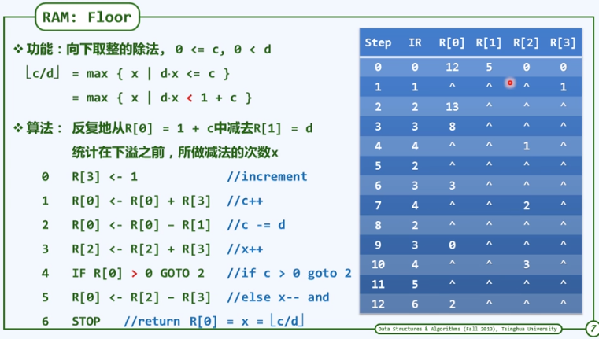
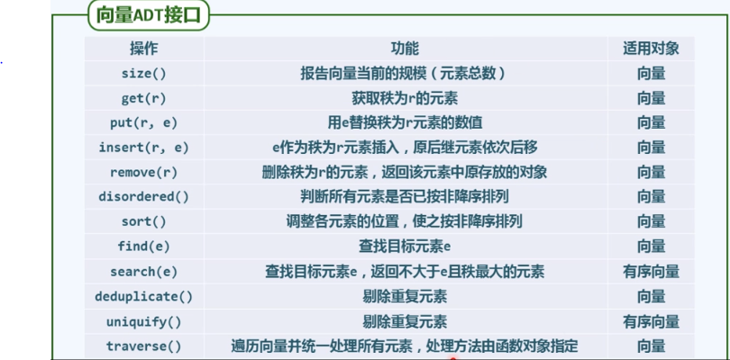

绪论

## （a）计算

​		计算既是数据结构的研究对象（研究在计算的过程中所蕴含的本质的内在规律，以及典型的技巧），也是最终的研究目的和目标（实现有效的、高效的计算）。甚至可以扩展到整个计算机科学。

​		**计算机只是我们的一个工具和手段，而计算才是我们不应忘记的最终目的和目标。**

​		例子：  绳索计算机（过直线一点作其垂线）
​					尺规计算机（在给定的一条线段找到两个分点，使得一条线段均匀分为三条）

- 计算 = 信息处理
  借助某种工具，遵照一定规则，以明确而机械的形式进行

- 计算模型 = 计算机 = 信息处理工具
  所谓算法，即特定计算模型下，旨在解决特定问题的指令序列
  			**输入**		待处理的信息（问题）
  			**输出**		经处理的信息（答案）
  		**正确性**		的确可以解决指定的问题 		 *但在实际情况中这条不是每次都能证明*
  		**确定性**		任一算法都可以描述为一个由基本操作组成的序列
  		**可行性**		每一基本操作都可以实现，且在常数时间内完成
  		**有穷性**		对于任何输入，经有穷次基本操作，都可以得到输出

  

  例：序列
  $$
  Hailstone(n) = 
  \begin{cases}
  	\{1\} & n\leq 1\\
  	\{n\}\bigcup Hailstone(n/2) & \text n偶\\
  	\{n\}\bigcup Hailstone(3n+1) & \text =奇\\
  \end{cases}
  $$
  ```c++
#include <iostream>
  using namespace std;
  
  int Hailstone(int n){
    cout <<n <<", ";
      int length = 1;
      while(1 != n){
          if(n % 2)
              return length + Hailstone(3 * n + 1);
          else
              return length + Hailstone(n / 2);
      }
      return 1;
  }
  
  int main()
  {
      cout <<"Hailstone(n) =";
      int length = Hailstone(42);
      cout <<endl <<"一共有" <<length <<"个元素" <<endl;
      return 0;
  }
  ```
  
  Hailstone(42) = {42 , 21 , 64 , 32, ... ,1} 																				9
  Hailstone(7) = {7, 22, 11, 34, 17, 52, 26, 13, 40, 20, 10, 5, 16, 8, 4, 2, 1}					 	17
  Hailstone(27) = {27, 82, 41, 124, 62, 31, 94, 47, 142, 71, 214, 107, ... , 1}					  112
  
  但对于任意的n，总有
  $$
  |Hailstone(n)| < \infty \ ?
  $$
  目前这个问题还没有确切的结论，也就是说我们既不能证明对于任何的n，这个序列都必然是有穷的，也不能找到一个反例。因此这段**程序未必是算法**。
  $$
  程序 \not= 算法
  $$

我们的问题：在正确性确定性可行性包括有穷性都基本上确定了之后，如何能够设计优化出更好的一个计算过程，一个对应的数据结构和对应的算法？

但什么样的算法才是好的数据结构，好的计算过程呢？

### 好算法

1. 正确：符合语法，能够编译、链接
   $$
   能够正确处理
   \begin{cases}
   简单的\\
   大规模的\\
   一般性的\\
   退化的\\
   任意合法的\\
   \end{cases}
   \ 输入
   $$


2. 健壮：能辨别不合法的输入并做适当处理，而不致非正常退出

3. 可读：结构化 + 准确命名 + 注释 + ···

4. **效率：速度尽可能快；存储空间尽可能少**——这才是我们最关心的问题
   $$
   Algorithms\ +\ Data\ Structures\ =\ Programs	\ \ \ \ \ \ \ \ \ //N.Wirth, 1976\\
   (Algorithms\ +\ Data\ Structures)\ *\ Efficiency\ =\ Computation
   $$

## (b)计算模型

1. 引入理想、统一、分层次的尺度
2. 运用该尺度，以测量DSA的性能

这里的测量测度实际上是算法分析的范畴。

### 算法分析

- 两个主要方面：

  1. 正确性：算法功能与问题要求一致？
     				数学证明往往非常困难...因此不是数据结构的重点

  2. 成本：运行时间 + 所需存储空间
                 如何度量？如何比较？

- 考察：T<sub>A</sub>(P) = 算法A求解问题实例P的计算成本
  意义不大，毕竟...可能出现的问题实例太多，如何归纳概括？

- 观察：问题实例的<font color=#ff0000>规模</font>,往往是决定计算成本的主要因素  <!--大体来说是这样的-->

- 通常：规模接近，计算成本也接近
              规模扩大，计算成本亦上升

  - #### 特定算法 + 不同实例

    - 令T<sub>A</sub>(n) = 用算法A求解某一问题规模为n的实例，所需的计算成本
      讨论特定算法A(及其对应的问题)时，简记作T(n)

    - 然而，这一定义仍有问题

    - 观察：同一问题等规模的不同实例，计算成本不尽相同，甚至有实质差别

    - 例如：在平面上的n个点中，找到所成三角形面积最小的三个点

      ​           以蛮力算法为例，最坏情况下需枚举所有C(n,3)种组合
      ​			但运气好的话，第一次就找到了

    - **<font color = #ff0000>稳妥起见，在规模同为n的所有实例中，只关注最坏（成本最高）者</font>**

  - #### 特定问题 + 不同算法

    - 同一问题通常有多种算法，如何评判其优劣？

    - 实验统计是最直接的方法，但足以准确反映算法的真正效率？

    - 不足够！
      $$
      不同的算法
      \begin{cases}
      可能更适应于不同规模的输入\\
      可能更适应于不同类型的输入\\
      \end{cases}
      $$

      $$
      同一算法
      \begin{cases}
      可能由不同程序员、用不同程序语言、经不同编译器实现\\
      可能实现并运行于不同的体系结构、操作系统...\\
      \end{cases}
      $$

    - 为给出客观的评判，需要抽象出一个理想的平台或模型
                    不再依赖于上述种种具体的因素
                    从而直接而准确地描述、测量并评价算法

  - #### 图灵机（Turing Machine）

    - Tape	依次均匀地划分为单元格，各注有某一字符，默认为‘#’

    - Alphabet字符的种类有限

    - Head    总是对准某一单元格，并可读取和改写其中的字符；每经过一个节拍，可转向左侧或右侧的邻格

    - State      TM总是处于有限种状态中的某一种，每经过一个节拍，可（按照规则）转向另一种状态

    - Transition Function(q, c; d, L/R, p)
                 若当前状态为q且当前字符为c，则将当前字符改写为d；转向左侧/右侧的邻格；转入p状态；一旦转入特定的状态'h'，则停机

    - ##### 图灵机实例

      

    - ##### RAM: <u>Random Access Machine</u>

      

    - RAM实例
      

      执行过程可以记录为一张表
      表的行数即是所执行基本指令的总条数
      能够客观度量算法的执行时间

    - **图灵机、RAM等模型为度量算法性能提供了准确的尺度**

## c)大O记号

渐进分析：在问题规模足够大后，算法
					需执行基本操作次数：T(n) = ?
					需占用的存储单元数：S(n) = ?															<font color = #0000ff>通常不考虑</font>

#### 大o记号(big-o notation)：

​				T(n) = of(n))   if  存在c > 0，当n >> 2后，有T(n) < c · f(n)
例：
$$
\sqrt{5n*[3n*(n+2)+4]+6}<\sqrt{5n*[6n^2+4]+6}<\sqrt{35n^3+6}<6n^{1.5}=o(n^{1.5})
$$
与T(n)相比，f(n)更为简洁，但依然反映前者的增长趋势
			<font color=#ff0000>常系数可忽略，低次项可忽略</font>

<font color=#ff0000>O(1) < O(log*n*) < O(n) < O(nlogn) < O(n<sup>2</sup>) < O(2<sup>n</sup>) </font>

 #### 大Ω记号(big-Ω notation):

​				T(n) = Ω(f(n)) 	存在c > 0，当n >> 2后，有T(n) > c · f(n)

#### 大θ记号(big-θ notation)：Pride and Prejudice

​				T(n) = θ(f(n))	当n >> 2后，有c<sub>1</sub>·f(n) > T(n) > c<sub>2</sub>·f(n)

 

## d)算法分析

- 两个主要任务 = 正确性（不变性 x 单调性） + 复杂度

- C++等高效语言的基本指令，均等效于常数条RAM的基本指令;在渐进意义下，二者大体相当

- 复杂度分析的主要方法：

  - 迭代：级数求和
  - 递归：递归跟踪 + 递推方程
  - 猜测 + 验证

- 级数

  - 算术级数：与末项平方同阶
    		T(n) = 1 + 2 + ··· + n = n(n+1)/2 = O(n<sup>2</sup>)

  - 幂方级数：比幂次高出一阶

    ​        T<sub>2</sub>(n) = 1<sup>2</sup> + 2<sup>2</sup> + 3<sup>2</sup> + ··· + n<sup>2</sup> = n(n+1)(2n+1)/6 = O(n<sup>3</sup>)
    ​		T<sub>3</sub>(n) = 1<sup>3</sup> + 2<sup>3</sup> + 3<sup>3</sup> + ··· + n<sup>3</sup> = n<sup>2</sup>(n+1)<sup>2</sup>/4 = O(n<sup>4</sup>)
    ​		T<sub>4</sub>(n) = 1<sup>4</sup> + 2<sup>4</sup> + 3<sup>4</sup> + ··· + n<sup>4</sup> = n(n+1)(2n+1)(3n<sup>2</sup>+3n-1)/30 = O(n<sup>5</sup>)
    ​		···

  - 几何级数（a>1）：与末项同阶
            T<sub>a</sub>(n) = a<sup>0</sup> + a<sup>1</sup> + ... + a<sup>n</sup> = (a<sup>n+1</sup>-1)/(a-1) = O(a<sup>n</sup>)

  - 收敛级数
            1/1/2 + 1/2/3 + 1/3/4 + ... + 1/(n-1)/n = 1-1/n = O(1)
            1 + 1/2<sup>2</sup> + ... +1/n<sup>2</sup> < 1 + 1/2<sup>2</sup> + ...  = π<sup>2</sup>/6 = O(1)
            1/3 + 1/7 +1/8 + 1/15 + 1/24 + 1/26 + 1/31 + 1/35 + ... = 1 = O(1)

    - (1-p)·[1+2p+3p<sup>2</sup>+4p<sup>3</sup>+...] = 1/(1-p) = O(1) ,	0<p<1				//几何分布
    - 可能未必收敛，然而长度有限
      h(n) = 1 + 1/2 + 1/3 + ... + 1/n = O(logn)                                   //调和级数
      log1 + log2 + log3 + ... + logn = log(n!) = O(nlogn)                  //对数级数
    - 书籍推荐：**Concrete Mathematics**

# 向量

 ## a)接口与实现

抽象数据类型(Abstract Data Type) = 数据模型 + 定义在该模型上的一组操作
数据结构(Data Structure) = 基于某种特定语言，实现ADT的一整套算法

### 从数组到向量

* 在C/C++语言中，数组A[]中的元素与[0,n]内的编号一一对应；反之，每个元素均由(非负)编号唯一指代，并可<font color=ff0000>直接</font>访问，A[i]的物理地址 = A + i * s，s为单个元素占用的空间量，故亦称作线性数组(linear array)
* 向量是数组的抽象与泛化，由一组元素按线性次序<font color=ff0000>封装</font>而成
                       各元素与[0,n]内的秩(rank)一一对应                       <font color=0000ff>//循秩访问(call-by-rank)</font>
                       元素的类型不限于基本类型
                       操作、管理维护更加简化、同一与安全
                       可更为便捷地参与复杂数据结构的定制与实现

### 向量ADT接口



## b)可扩充向量

### 静态空间管理

* 开辟内部数组_elem[]并使用一段地址连续的物理空间

  _capacity：总容量

  _size：当前的实际规模n

* 采用静态空间管理策略，容量_capacity固定，则有明显不足

  1. <font color=ff000>上溢</font>(overflow)：_elem[]不足以存放所有元素，尽管此时系统仍有足够的空间

  2. <font color=ff000>下溢</font>(underflow)：_elem[]中的元素寥寥无几

     ​              装填因子(load factor) λ = _size / _capacity << 50%

* 糟糕的是，一般的应用环境中难以准确预测空间的需求量，所以需要一种可以动态调整容量的向量，同时保证高效率

### 动态空间管理

* 蝉的哲学：

  ​	身体每经过一段时间的生长，以致无法为外壳容纳，即蜕去原先的外壳，代之以...

* 在即将发生<font color=ff000>上溢</font>时，适当地扩大内部数组的容量

#### 扩容算法实现

```c++
template <typename T>
void Vector<T>::expand(){ //向量空间不足时扩容
	if(_size < _capacity) return; //尚未满员时，不必扩容
    _capacity = max(_capacity, DEFAULT_CAPACITY); //不低于最小容量
    T* oldElem = _elem; _elem = new T[_capacity <<= 1]; //容量加倍
    for(int i = 0; i < _size; i++) //复制原向量内容
        _elem[i] = oldElem[i]; //T为基本类型，或已重载赋值操作符'='
    delete [] oldElem; //释放原空间
}
```

* 得益于向量得封装，尽管扩容之后数据区的物理地址有所改变，却不致出现野指针

##### 容量递增策略

<font color=ff0000>``T* oldElem = _elem; _elem = new T[_capacity += INCREMENT]; //追加固定大小的容量``</font>

* 最坏情况：在初始容量0的空向量中，连续插入n = m*I >> 2个元素...

  于是，在第1、I+1、2I+1、3I+1、...次插入时，都需扩容

  即便不计申请空间操作，各次扩容过程中复制向量的时间成本依次为

  ​			0，I，2I，...，(m-1)I																		<font color=0000ff>//算术级数</font>

  总体耗时 = I\*(m-1)\*m/2 = O(n<sup>2</sup>)，每次扩容的分摊成本为O(n)

##### 容量加倍策略

<font color=ff0000>``T* oldElem = _elem; _elem = new T[_capacity <<= 1]; //容量加倍``</font>

* 最坏情况：在初试容量1的满向量中，连续插入n = 2<sup>m</sup> >> 2个元素...

  于是，在第1、2、4、8、16、...次插入时都需要扩容

  各次扩容过程中复制原向量的时间成本依次为

  ​		  1，2，4，8，...，2<sup>m</sup> = n																<font color=0000ff>//几何级数</font>

  总体耗时 = O(n)，每次扩容的分摊成本为O(1)


#### 平均分析 vs. 分摊分析

* 平均时间复杂度或期望复杂度(average/expected complexity)

  根据数据结构各种操作出现概率的分布，将对应的成本加权平均

  ​	各种可能的操作，作为独立事件分别考查

  ​	割裂了操作之间的相关性和连贯性

  ​	往往不能准确地评判数据结构和算法地真实性能

* 分摊复杂度(amortized complexity)

  对数据结构连续地实施足够多次操作，所需总体成本分摊至单次操作

  ​	从实际可行地角度，对一系列操作做整体的考量

  ​	更加忠实地刻画了可能出现的操作序列

  ​	可以更为准确地评判数据结构和算法的真实性能

## c)无序向量

### 循秩访问

向量通过get()和put()接口，来对数据进行读、写，但不如数组直接通过下标来访问这么自然.

解决的方法之一就是重载操作符“[]”，具体实现如下：

```c++
template <typename T>
T& Vector<T>::operator[](Rank r) const
	{return _elem[r];}
```

此后，对外的V[r]即对应于内部的V._elem[r]。

### 插入

```c++
template <typename T>	//e作为秩为r元素插入，0 <= r <= size
Rank Vector<T>::insert(Rank r, T const & e){
    expand();	//如有必要，扩容
    for(int i = _size; i > r; i--)	//自后向前
        _elem[i] = _elem[i-1];	//后继元素顺次后移一个单元
    _elem[r] = e; _size++;	//置入新元素，更新容量
    return r;	//返回秩
}
```

### 区间删除

```c++
template <typename T>	//删除区间[lo,hi],0 <= lo <= hi <= size
int Vecotor<T>::remove(Rank lo,Rank hi){
    if(lo == hi) return 0;	//处于效率考虑，单独处理退化情况
    while(hi < _size)
        _elem[lo++] = _elem[hi++];	//[hi,_size)顺次前移hi-lo位
    _size = lo; shrink();	//更新规模，若有必要则缩容
    return hi - lo;	//返回被删除元素的数目
}
```

### 单元素删除

* 可以视作区间删除操作的特例：[r] = [r,r + 1)

```c++
template <typename T>	//删除向量中秩为r的元素，0 <= r < size
T Vector<T>::remove(Rank r){
    T e = _elem[r];		//备份被删除的元素
    remove(r,r + 1);	//调用区间删除算法
    return e;	//返回被删除元素
}
```

### 查找

* 无序向量：T为可<font color=ff0000>判等</font>的基本类型，或已重载操作符"=="或"!="
* 有序向量：T为可<font color=ff0000>比较</font>的基本类型，或已重载操作符"<"或">"

```c++
template <typename T>
Rank Vector<T>::find(T const & e, Rank lo, Rank hi) const{	//在命中多个元素时可返回秩最大者
    while((lo < hi--) && (e != _elem[hi]));		//逆向查找
    return hi;		//hi < lo意味着失败；否则hi即命中元素的秩
}
```

这类最好为O(1)，最差为O(n)，即最好与最差相差悬殊的算法叫做输入敏感算法

### 唯一化

#### 算法

* 应用实例：网络搜索的局部结果经过去重操作，汇总为最终报告

```c++
template <typename T>	//删除重复元素，返回被删除元素数目
int Vector<T>::deduplicate(){
    int oldsize = _size;	//记录原规模
    Rank i = 1;		//从_elem[1]开始
    while(i < _size)	//自前向后逐一考查各元素_elem[i]
        (find(_elem[i], 0, u) < 0)?		//在前缀中寻找雷同者
        i++		//若无雷同则继续考查其后继
        :remove(i);		//否则删除雷同者
    return oldsize - _size;		//向量规模变化量，即删除元素总数
}
```

#### 正确性

* 不变性：在当前元素V[i]的前缀V[0,i)中，各元素彼此互译

  初始i = 1时自然成立；其余的一般情况，...

* 单调性：随着反复的while迭代

  1. 当前元素前缀的长度单调非降，且迟早增至_size

  2. 当前元素后缀的长度单调下降，且迟早减至0

  故算法必然终止，且至多迭代O(n)轮

#### 复杂度

* 每轮迭代中find()和remove()累计耗费线性时间，故总体为O(n<sup>2</sup>)

* 可进一步优化，比如...

  1. 仿照uniquify()高效版的思路，元素移动的次数可降至O(n)

     但比较次数依然是O(n<sup>2</sup>)；而且，稳定性将被破坏

  2. 先对需要删除的重复元素做标记，然后再统一删除

     稳定性保持，但因查找长度更长，从而导致更多的比对操作

  3. V.sort().uniquify()：简明实现最优的O(nlogn)

### 遍历

* 遍历向量，统一对各元素分别实施visit操作

  如何指定visit操作？如何将其传递到向量内部？

  1. 利用<font color=ff0000>函数指针</font>机制，只读或局限性修改

     ```c++
     template <typename T>
     void Vector<T>::traverse(void (*visit)(T&))	//函数指针
     {	for(int i = 0; i < _size; ++i)	visit(_elem[i]);	}
     ```

  2. 利用<font color=ff0000>函数对象</font>机制，可全局性修改

     ```c++
     template <typename T>
     void Vector<T>::traverse(VST& visit)	//函数对象
     {	for(int i = 0; i < _size; ++i)	visit(_elem[i]);	}
     ```

* **实例**

  比如：为统一将向量中所有元素分别加一。

  ​	首先，实现一个可以使单个T类型元素加一的类

  ```c++
  template <typename T>	//假设T可直接递增或已重载操作符"++"
  struct Increase{	//函数对象：通过重载操作符"()"实现
      virtual void operator()(T & e)	{	e++;	}	//加一
  };
  ```

  ​	此后...

  ```c++
  template <typename T>
  void increase(Vecto<T> & V){
      V.traverse(Increase<T>());	//即可以作为基本操作遍历向量
  }
  ```


## d）有序向量

### 有序性及其甄别

* 与起泡排序算法的理解相同

  <font color=ff0000>有序/无序</font>序列中，<font color=ff0000>任意/总有</font>一对相邻元素<font color=ff0000>顺序/逆序</font>

  因此，相邻逆序对的数目，可用以度量向量的<font color=ff000>逆序</font>程度

* 算法：

  ```c++
  template <typename T>
  int Vector<T>::disordered() const{	//返回逆序相邻元素对的总数
      int n = 0;	//计数器
      fot(int i = 1; i < _size; ++i)	//逐一检查各对相邻元素
          n += (_elem[i - 1] > _elem[i]);	//逆序则计数
      return n;	//向量有序当且仅当n = 0
  }	//若只需判断是否有序，则首次遇到逆序对之后，即可立即终止
  ```

* 无序向量经预处理转换为有序向量之后，相关算法多可优化，相应的所得要远远比转换时所花费的成本大得多

### 唯一化

#### 低效算法

* 观察：在有序向量中，重复的元素必然相互紧邻构成一个区间。因此，每一区间只需保留单个元素即可

```c++
template <typename T>
int Vector<T>::uniquify(){
    int oldsize = _size;	int i = 0;	//从首元素开始
    while(i < _size - 1)	//从前向后，逐一比对各相邻元素
        //若雷同，则删除后者；否则，转至后一元素
        (_elem[i] == _elem[i + 1]) ? remove(i + 1) : i++;
    return oldsize - _size;
}	//注意：其中_size的减小，由remove(隐式地完成)
```

* 复杂度

  运行时间主要取决于while循环，次数共计：_size - 1 = n - 1

  最坏情况下：每次都需要调用remove()，耗时O(n-1)~O(1)；累计O(n<sup>2</sup>)

  ——尽管省区find()，总体竟与无序向量的deduplicate()相同

#### 高效算法

* 反思：低效的根源在于，同一元素可作为被删除元素的后继多次前移

  启示：若能以重复区间为单位，成批删除雷同元素，性能必将改进

```C++
template <typename T>
int Vector<T>::uniquify(){
    Rank i = 0, j = 0;	//各对互异"相邻"元素的秩
    while(++j < _size)	//逐一扫描，直至末元素
        //跳过雷同者；发现不同元素时，向前移至紧邻于前者右侧
        if(_elem[i] != _elem[j])	_elem[++i] = _elem[j];
    _size = ++i;	shrink();	//直接截除尾部多余元素
    return j - i;	//向量规模变化量，即被删除元素总数
}	//注意：通过remove(lo,hi)批量删除，依然不能达到高效率
```

* 实例与复杂度

  共计n - 1次迭代，每次常数时间，累计O(n)时间

### 查找

* 统一接口

  ```c++
  template <typename T>	//查找算法统一接口，0 <= lo < hi <= _size
  Rank Vector<T>::search(T const & e, Rank lo, Rank hi) const{
      return (rand() % 2) ?	//按各50%的概率随机选用
          binSearch(_elem, e, lo, hi)		//二分查找算法，或者
        : fibSearch(_elem, e, lo, hi);	//Fibonacci查找算法
  }
  ```

* 语义约定

  至少，应该便于有序向量自身的维护：V.insert(1 + V.search(e), e)

  ​		即便失败，也应给出新元素适当的插入位置

  ​		若允许重复元素，则每一组也需按插入的次序排列

  约定：在有序向量区间v[lo, hi)中，确定<font color="green">`不大于e的最后一个`</font>元素(秩)

  ​			若-∞ < e < V[lo]，则返回<font color=00b22>lo - 1</font>(左侧哨兵)

  ​			若V[hi - 1] < e < +∞，则返回<font color=22b22>hi - 1</font>(末元素 = 右侧哨兵左邻)

#### 二分查找

* 原理

减而治之：以任一元素x = S[mi]为界，都可将待查找区间分为三部分

​		$S[lo, mi) <= S[mi] <= S(mi, hi)$							<font color=00ffff>//S[mi]称作轴点</font>

只需将目标元素e与x做一比较，即可分三种情况进一步处理：

1. e < x：则e若存在必属于<font color=ff0000>左</font>侧子区间S[lo, mi)，故可递归深入
2. x < e：则e若存在必属于<font color=ff0000>右</font>侧子区间S(mi, hi)，亦可递归深入
3. e = x：已在此处<font color="red">命中</font>，可随即返回                               <font color=00ffff>//若有多个，返回何者？</font>

* 二分(折半)策略

  轴点mi总是取作中点——于是每经过<font color="red">至多两次</font>比较，或者能够命中，或者将问题规模缩减一半

* 实现<font color="red">(版本A)</font>

  ```c++
  template <typename T>	//在有序向量区间[lo, hi)内查找元素e
  static Rank binSearch(T* A, T const& e, Rank lo, Rank hi){
      while(lo < hi){		//每步迭代可能要做两次比较判断，有三个分支
          Rank mi = (lo + hi) >> 1;	//以中点为轴点
          if		(e < A[mi])		hi = mi;	//深入前半段[lo, hi)继续查找
          else if	(A[mi] < e)		lo = mi + 1;	//深入后半段(mi, hi)
          else					return mi;	//在mi处命中
      }
      return -1;	//查找失败
  }
  ```

  1. 实例与复杂度

     线性递归：$T(n) = T(n/2) + O(1) = O(\log n)$，大大优于顺序查找

     递归跟踪：轴点总取中点，递归深度$O(logn)$；各递归实例均耗时$O(1)$

  2. 查找长度


#### Fibonacci查找

* 思路及原理

  1. 二分查找版本A的效率仍有改进余地，因为不难发现

     转向左、右分支前关键码<font color="red">比较次数</font>不等，而<font color="red">递归深度</font>却相同

     

  2. 若能通过<font color="red">递归深度</font>的不均衡，对<font color="red">转向成本</font>的不均衡进行<font color="red">补偿</font>平均查找长度应能进一步缩短...

  3. 比如，若设$n = fib(b) - 1$，则可取$mi = fib(k - 1) - 1$

     于是，前、后子向量的长度分别为$fib(k - 1) - 1、fib(k - 2) - 1$

* 实现

  ```c++
  template <typename T>	//0 <= lo <= hi <= _size
  static Rank fibSearch(T* A, T const & e, Rank lo, Rank hi){
      Fib fib(hi - lo);	//用O(logn) = O(log(hi - lo))时间创建Fib数列
      while(lo < hi){
          while(hi - lo < fib.get())	fib.prev();		//至多迭代几次？
          	//通过向前顺序查找，确定形如Fib(k) - 1的轴点(分摊O(1))
          Rank mi = lo + fib.get() - 1;	//按黄金比列切分
          if		(e < A[mi])		hi = mi;	//深入前半段[lo, mi)继续查找
          else if (A[mi] < e)		lo = mi + 1;	//深入后半段(mi, hi)
          else					return mi;	//在mi处命中
      }
      return -1;	//查找失败
  }
  ```

* 实例及查找长度

  就平均查找长度与二分查找算法版本A实例相比，的确有所改进

* 最优性$\phi = 0.6180339...$

  1. 通用策略：对于任何的$A[0,n]$，总是选取$A[\lambda n]$作为轴点，$0 \leq \lambda \leq 1$

     比如：二分查找对应于$\lambda = 0.5$，Fibonacci查找对应于$\lambda = \phi = 0.6180339...$

  2. 在$[0,1)$内，$\lambda$如何取值才能达到<font color="red">最优</font>？设平均查找长度为$\alpha(\lambda)\cdot \log_2n$，何时$\alpha(\lambda)$<font color="red">最小</font>？

     递推式：$\alpha(\lambda)\cdot\log_2n = \lambda\cdot[1+\alpha(\lambda)\cdot\log_2(\lambda n)]+(1-\lambda)\cdot[2+\alpha(\lambda)\cdot\log_2((1-\lambda)n)]$

     整理后：$\frac{-\ln2}{\alpha(\lambda)}=\frac{\lambda\cdot\ln\lambda+(1-\lambda)\cdot\ln(1-\lambda)}{2-\lambda}$,当$\lambda = \phi$时，$\alpha(\lambda) = 1.440420...$达到最小

     

* 注：计算各向量长度的平均成功查找长度、平均失败查找长度，如下表所示。

  1. 向量长度等于 `fibnacci数 - 1` 时，在平均查找长度的意义上，fib 查找的比二分查找（版本 A）更有优势；
  2. 向量长度比 `fibnacci数 - 1` 稍小一点时，因为分得没那么均匀了，因此 fib 查找的平均查找长度的优势没那么明显；
  3. 向量长度比 `fibnacci数 - 1` 稍大一点时，fib 查找会为了那 1 个多余的元素，整体多一层查找，查找长度反而比二分查找大。

#### 二分查找(改进)

1. 改进思路

   * 二分查找中左、右分支转向代价不平衡的问题，也可**`直接`**解决

   * 比如：每次迭代(或每个递归实例)仅做`1次`关键码比较

     如此，所有分支只有`2个`方向，而不再是`3个`

   * 同样地，轴点mi取作中点，则查找每深入一层，问题规模也缩减一半

     * `e < x`：则e若存在必属于左侧子区间$S[lo, mi)$，故可递归深入
     * `x <= e`：则e若存在必属于右侧子区间$S[mi, hi)$，故可递归深入

     只有当元素数目$hi - lo = 1$时，才判断该元素是否命中

2. 实现<font color="red">(版本B)</font>

   ```c++
   template <typename T>
   static Rank binSearch(T* A, T const & e, Rank lo, Rank hi){
       while(1 < hi - lo){	//有效查找区间的宽度缩短至1时，算法才会终止
       	Rank mi = (lo + hi) >> 1;	//以中点为轴点，经比较后确定深入
           (e < A[mi]) ? hi = mi : lo = mi;	//[lo, mi)或[mi, hi)
       }	//出口时hi = lo + 1，查找区间仅含一个元素A[lo]
       return (e == A[lo]) ? lo : -1;	//返回命中元素的秩或者-1
   }//相对于版本A，最好(坏)情况下更坏(好)；各种情况下的SL更加接近，整体性能更趋稳定
   ```

   * 以上二分查找及Fibonacci查找算法

     均未严格地兑现search()接口的语义约定：返回`不大于e的最后一个`元素

   * 只有兑现这一约定，才可有效支持相关算法，

     比如：`V.insert(1 + V.search(e),e)`

     * 当有多个命中元素时，必须返回**最靠后(秩最大)者**
     * 失败时，应返回**小于e的最大者(含哨兵[lo - 1])**

3. 实现<font color="red">(版本C)</font>

   ```c++
   template <typename T>
   Static Rank binSearch(T* A, T const & e, Rank lo, Rank hi){
       while(lo < hi){	//不变性：A[0, lo) <= e < A[hi, n)
       	Rank mi = (lo + hi) >> 1;	//以中点为轴点，经比较后确定深入
           (e < A[mi]) ? hi = mi : lo = mi + 1;	//[lo, mi)或(mi, hi)
       }	//出口时，A[lo = hi]为大于e的最小元素
       return --lo;	//故lo - 1即大于e的元素的最大秩
   }
   ```

   * 与<font color="red">版本B</font>的差异

     1. 待查找区间宽度缩短至`0`而非`1`时，算法才结束
     2. 转入右侧子向量时，左边界取作`mi + 1`而非`mi`——A[mi]会被遗漏？
     3. 无论成功与否，返回的秩严格符合接口的语义约定...

   * **正确性**

     * 不变性：$A[0,lo) <= e < A[hi,n)$			//A[hi]总是大于e的最小者

     * 初始时，$lo = 0$且$hi = n,A[0,lo) = A[hi,n) = \empty$,自然成立

     * 数学归纳：假设不变性一直保持至(a)，以下无非两种情况...

     * 单调性：显而易见

       `

#### 插值查找

